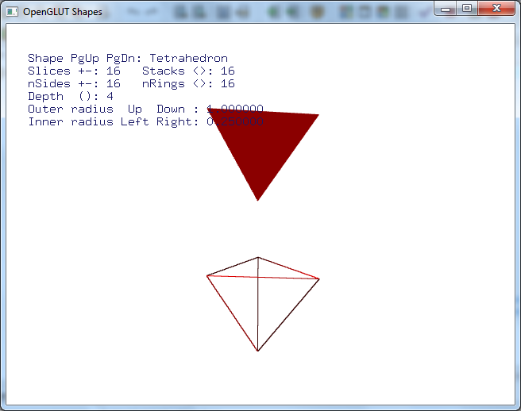

Initial Graphics Testing
########################

..  include::   /references.inc

Once you get your graphics library added to your system, we need to make sure
you can build a graphics program using the tools I am providing for your class.

Testing Graphics Libraries
**************************

The first thing to do is make sure you can build a graphics program in Dev-C++.

Open up the IDE as usual. Then create a new project. This time, we will choose
:menuselection:`File -> New -> Project`. In the window that pops up, click on
the :menuselection:`Multimedia` tab and click on ``freeglut``. Save the project
control file in a new directory (as you should be doing for each project you
set up). Name it something appropriate.

Once the project has been set up, you will see a screen with a basic template
program loaded. Before you do anything, make sure this test program runs.

Click on :menuselection:`Execute -> Compile and Run`. You will need to save the
``main.cpp`` file before the system will compile and run your program.

With any luck, you will see something like this:

    :align" center

The exact demo may vary depending on which ``freeglut`` library you loaded.
The point of this exercise is to ensure that all the graphics components are in
place and working properly. If you see this image (or something similar) you
are ready for the next step.

Installing Class Graphics Code
******************************

I have created a pair of additional files you need to download onto your system
and install in your project folder for each class project. You should download
these two files, and save them in a folder where you can copy them to projects
as needed.

    * :download:`Graphics.h`

    * :download:`Graphics.cpp`

    * :download:`main.cpp`

I keep these three files in a folder named ``lib`` which is located in the
folder where I keep all projects I set up for this class. 

..  note::  

    A copy of all of this code is on my GitHub_ account at
    http://github.com/rblack42/cosc1315.code.git. You can copy any of the files
    you see here using your browser, or download the entire thing to your
    system using the ``Download ZIP`` link on the page.  
    
Creating a Class Project 
************************

Now close your test project and start a new one. This time, delete the demo
``main.cpp`` that is initially in the project. You can do this by making sure
the file name is visible in the left panel (click on the + symbol to see
project files). Right-click on ``main.cpp`` and choose ``Remove from Project``.
Do not save the file if the system asks, we just want this file to go away.

Next, copy the three sample files you downloaded into this project folder using
`Windows Explorer`, then click on :menuselection:`Project -> Add to Project`.
Select all three files (using Ctrl-Click on each one), then click on "Open".
You should now see the three files in your project:

Once the three files are listed in the left panel, click on
:menuselection:`Execute -> Compile and Run`. If things are working right, you
should see a window with a red ball in the lower left corner of the window. 

..  note::

    If this does not work, contact me to see what we can do to fix your setup.

